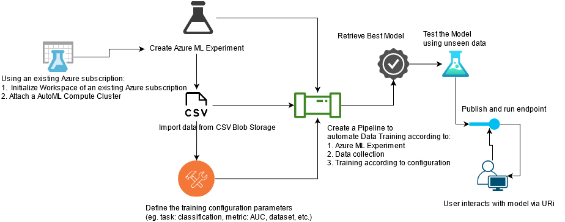

# Optimizing an ML Pipeline in Azure
## by Cristian Alberch as part of Udacity Nanodegree "Machine Learning Engineer with Azure"
This project is part of the Udacity Azure ML Nanodegree.

## Overview

In this project, we build an Azure AutoML pipeline using Python SDK for a classifier prediction application.

The ficticious dataset belongs to a bank and includes 20 different features from its customers (age, job, marital status, loans, etc.) This dataset is mapped to a binary target (yes/no) to determine the marketing campaign effectiveness.

The automated Azure ML pipeline was built in Azure ML Studio following these steps:

- Authenticate: A Service Principal is created to limit the scope of the resource group using Python scripts and run from the command terminal in PowerShell.

- Create a ML model: An auto ML Model is created and run in Azure Auto ML. Provided the set of features and target variable, multiple models with different hyperparameters are run and the best one is selected.

- Deploy the best model: The selected model (the one with the highest accuracy in this case) is deployed using the URL provided in Azure ML Studio, and creating an Azure Container Instance (ACI) with Authentication enabled.

- Consume and interact with the model: The deployed model is accessed using the created endpoints in Azure ML. A script is run using new sample data, the given API and key in Azure ML.

## Architectural Diagram

## Key Steps

### Step 1: Authentication

A Service Principal is created to limit the scope of the resource group.

*Figure 1.1: Service Principal created from PowerShell terminal*

*Figure 1.2: Allow the Service Principal access to the Workspace:*

### Step 2: Automated ML Experiment
*Figure 2.1: A ML Experiment is created:*

*Figure 2.2: And the ML Experiment is completed:*

### Step 3: Deploy the Best Model

- The best model is selected for deployment.
- Model is deployed using Azure Container Instance.

### Step 4: Enable Logging
*Figure 4.1: Application insights is enabled:*

*Figure 4.2: And the output can be monitored:*

*Figure 4.3: The logs can be seen running script "logs.py":*

### Step 5: Swagger Documentation

*Figure 5.1: Swagger is used to document and consum RESTful web service:*

*Figure 5.2: Swagger provides information on types of HTTP requests that an API can consume POST: and GET: with details on the data:*

### Step 6: Consume Model Endpoints

*Figure 6.1: The model endpoints can be consumed by running a script from the terminal* 

*Figure 6.2: The models can be tested and consumed from Azure ML Studio*

### Step 7: Create, Publish, and Consume
*Figure 7.1: A AutoML Pipeline is started with a Experiment created:*

*Figure 7.2: The pipeline includes a automl_module that incorporates the AutoML pipeline in SDK.*

*Figure 7.3: The AutoML pipeline is published with a REST endpoint created for consumption.*

*Figure 7.4: The published pipeline can be run on demand:*

## Screen Recording
https://youtu.be/uE1wTV3_dtM

## Next Steps
The following could be used to improve the work:
1. Hyperparameter tuning could be used to improve the accuracy further.
2. The ML pipeline could be automated to run on scheduled and/or trigger events.
3. Azure Kubernetes could be used to improve the performance of the pipeline and ability to handle additional data.

